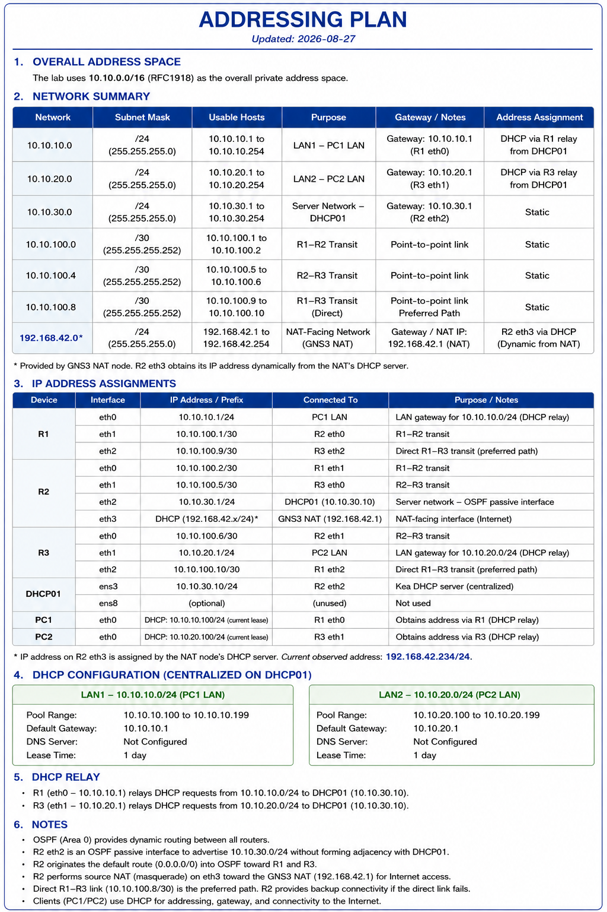

# Addressing Plan

**Last updated:** 2026-08-26

## Overview

The lab uses `10.10.0.0/16` as the overall RFC1918 private address space.

The current design contains two endpoint LANs and three point-to-point router transit networks. OSPF Area 0 provides dynamic routing between the routed networks. R1 also provides centralized DHCP service for both endpoint LANs, while R3 relays DHCP traffic for the remote PC2 LAN.

## Network Summary

| Network | Prefix | Purpose | Address Assignment |
|---|---:|---|---|
| `10.10.10.0` | `/24` | PC1 LAN | DHCP from R1 |
| `10.10.20.0` | `/24` | PC2 LAN | DHCP from R1 through R3 relay |
| `10.10.100.0` | `/30` | R1-R2 transit | Static |
| `10.10.100.4` | `/30` | R2-R3 transit | Static |
| `10.10.100.8` | `/30` | R1-R3 direct transit | Static |

## Interface Addressing

| Device | Interface | IPv4 Address | Connected Network | Purpose |
|---|---|---|---|---|
| R1 | `eth0` | `10.10.10.1/24` | `10.10.10.0/24` | PC1 default gateway; DHCP server-facing LAN |
| R1 | `eth1` | `10.10.100.1/30` | `10.10.100.0/30` | R1-R2 transit; available DHCP return interface during failover |
| R1 | `eth2` | `10.10.100.9/30` | `10.10.100.8/30` | Direct R1-R3 transit; preferred DHCP return interface |
| R2 | `eth0` | `10.10.100.2/30` | `10.10.100.0/30` | R1-R2 transit |
| R2 | `eth1` | `10.10.100.5/30` | `10.10.100.4/30` | R2-R3 transit |
| R3 | `eth0` | `10.10.100.6/30` | `10.10.100.4/30` | R2-R3 transit; backup routed path |
| R3 | `eth1` | `10.10.20.1/24` | `10.10.20.0/24` | PC2 default gateway; DHCP relay client-facing interface |
| R3 | `eth2` | `10.10.100.10/30` | `10.10.100.8/30` | Direct R1-R3 transit; preferred routed path |
| PC1 | `eth0` | DHCP | `10.10.10.0/24` | Client |
| PC2 | `eth0` | DHCP | `10.10.20.0/24` | Client |

## DHCP Addressing

### LAN1: PC1

- Network: `10.10.10.0/24`
- Default gateway: `10.10.10.1`
- DHCP server: R1
- DHCP pool: `10.10.10.100 - 10.10.10.199`

Example lease observed during testing:

```text
IP address: 10.10.10.100/24
Gateway:    10.10.10.1
```

### LAN2: PC2

- Network: `10.10.20.0/24`
- Default gateway: `10.10.20.1`
- DHCP server: R1
- DHCP relay: R3
- DHCP pool: `10.10.20.100 - 10.10.20.199`

Example lease observed during testing:

```text
IP address: 10.10.20.100/24
Gateway:    10.10.20.1
```

## DHCP Service Interface Binding

R1's DHCP service was configured to listen on the addresses required by the current topology and both routed return paths:

```text
10.10.10.1
10.10.100.1
10.10.100.9
```

This was necessary because the DHCP server must have a suitable socket open on the interface selected for the return path.

## Routing Notes

All routed networks participate in OSPF Area 0.

Under normal conditions, traffic between R1 and R3 uses the direct transit network:

```text
10.10.100.8/30
```

Preferred path:

```text
R1 -> R3
```

If the direct R1-R3 link fails, OSPF reconverges and uses the alternate path:

```text
R1 -> R2 -> R3
```

The DHCP service was tested successfully over both paths.

Here is a neat diagram that summarizes everything:




## Future Addressing Changes

The next milestone introduces VLAN segmentation and inter-VLAN routing. New VLAN-specific subnets will be added to this document as the topology expands.
