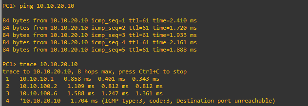
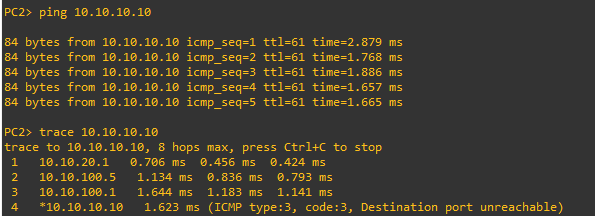

## OSPF Dynamic Routing Milestone
*August 24, 2026*

After verifying the network using static routing, I replaced the manually configured static routes with OSPF so that the routers could dynamically learn remote networks.

### Starting State

The topology remained:

PC1 --- R1 --- R2 --- R3 --- PC2

The existing addressing plan was unchanged:

- PC1 LAN: `10.10.10.0/24`
- R1-R2 transit: `10.10.100.0/30`
- R2-R3 transit: `10.10.100.4/30`
- PC2 LAN: `10.10.20.0/24`

Before configuring OSPF, I removed all previously configured static routes.

This caused PC1 to lose connectivity to PC2, which confirmed that the static routes were no longer providing the path between the two LANs.

### OSPF Configuration

I configured all routers in OSPF Area 0.

Router IDs:

- R1: `1.1.1.1`
- R2: `2.2.2.2`
- R3: `3.3.3.3`

R1:

`set protocols ospf parameters router-id '1.1.1.1'`

`set protocols ospf interface eth0 area 0`

`set protocols ospf interface eth1 area 0`

R2:

`set protocols ospf parameters router-id '2.2.2.2'`

`set protocols ospf interface eth0 area 0`

`set protocols ospf interface eth1 area 0`

R3:

`set protocols ospf parameters router-id '3.3.3.3'`

`set protocols ospf interface eth0 area 0`

`set protocols ospf interface eth1 area 0`

### OSPF Neighbor Relationships

After configuring OSPF, the routers discovered each other and formed OSPF adjacencies.

R1 formed a neighbor relationship with:

- R2 (`2.2.2.2`)

R2 formed neighbor relationships with:

- R1 (`1.1.1.1`)
- R3 (`3.3.3.3`)

R3 formed a neighbor relationship with:

- R2 (`2.2.2.2`)

The neighbor relationships reached the `Full` state.

The Ethernet links also performed OSPF DR/BDR elections.

### Dynamic Route Learning

After the neighbor relationships formed, OSPF automatically populated the routers' routing tables.

For example, R1 dynamically learned the PC2 LAN:

`O>* 10.10.20.0/24 [110/3] via 10.10.100.2, eth1`

This means:

- `O` = route learned through OSPF
- `>` = selected route
- `*` = route installed in the Forwarding Information Base (FIB)
- `110` = OSPF administrative distance
- `3` = OSPF cost
- `10.10.100.2` = next-hop router (R2)

R2 dynamically learned both remote LANs:

`10.10.10.0/24 via 10.10.100.1`

`10.10.20.0/24 via 10.10.100.6`

R3 dynamically learned the PC1 LAN:

`10.10.10.0/24 via 10.10.100.5`

No static routes were required.

### End-to-End Testing

After OSPF converged, I tested connectivity from PC1 to PC2.

PC1 successfully pinged:

`10.10.20.10`

Traceroute showed the expected path:

PC1
-> R1 (`10.10.10.1`)
-> R2 (`10.10.100.2`)
-> R3 (`10.10.100.6`)
-> PC2 (`10.10.20.10`)

This confirmed that OSPF had successfully replaced the previous static routes.

### Troubleshooting

During testing, PC1 and PC2 temporarily lost their IP configurations after the VPCS nodes restarted.

`show ip` showed:

`0.0.0.0/0`

I restored the IP addresses and default gateways and saved the VPCS configurations so that they persist after restart.

PC1:

`10.10.10.10/24`
Gateway: `10.10.10.1`

PC2:

`10.10.20.10/24`
Gateway: `10.10.20.1`

After restoring the host configurations, end-to-end connectivity worked normally.

### Result

The network now uses OSPF instead of static routing.

The routers dynamically exchange routing information and automatically populate their routing tables with remote networks.

Here is the result:

This completes the first single-area OSPF implementation.

### Next Steps

The next OSPF enhancement will be adding redundancy to the topology and testing how OSPF reacts to a link failure and recalculates the best path.