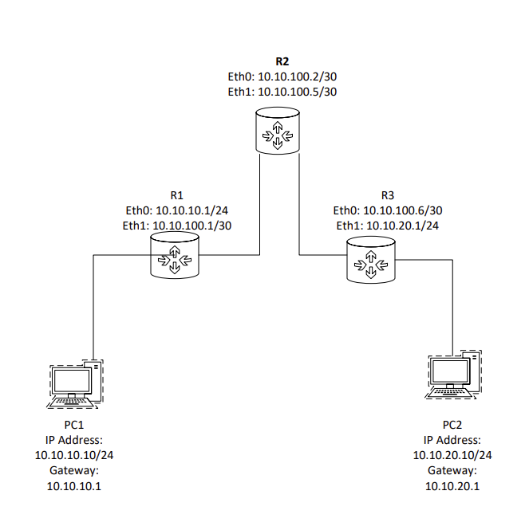
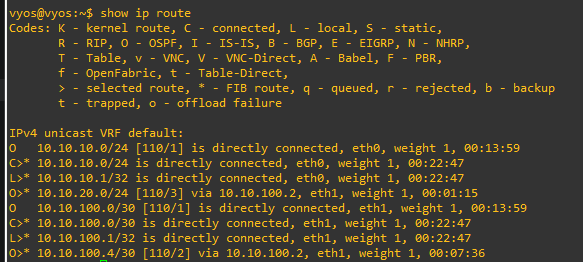
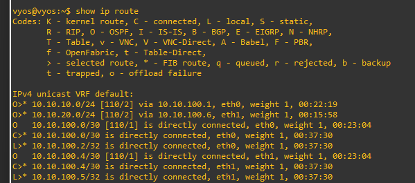
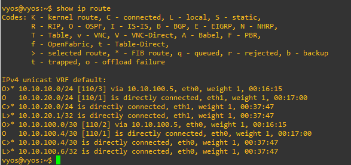
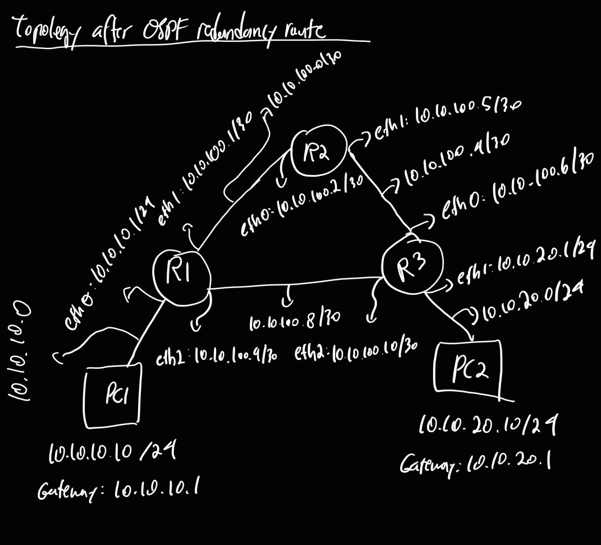
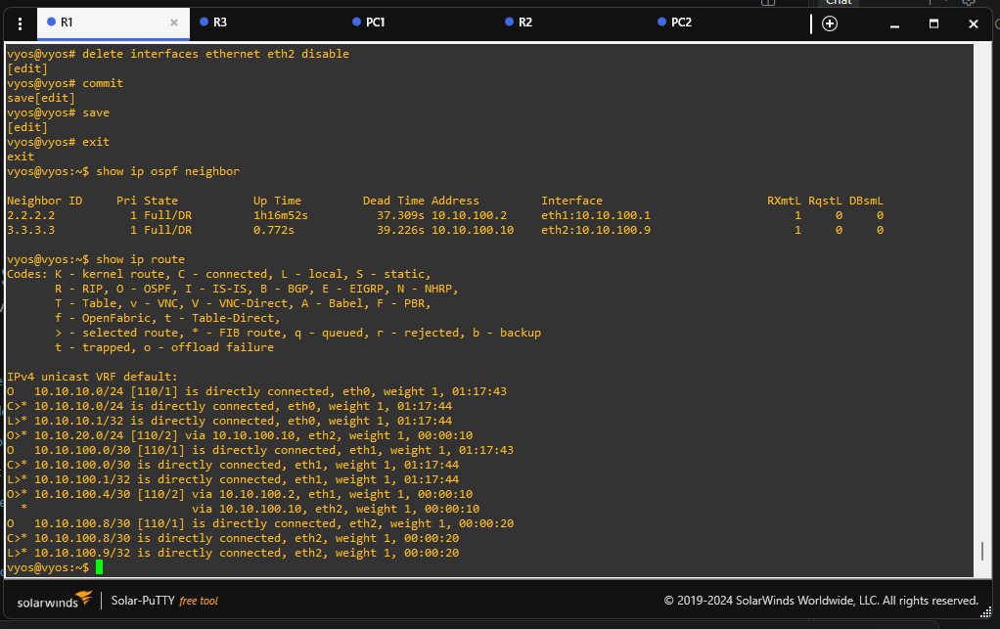
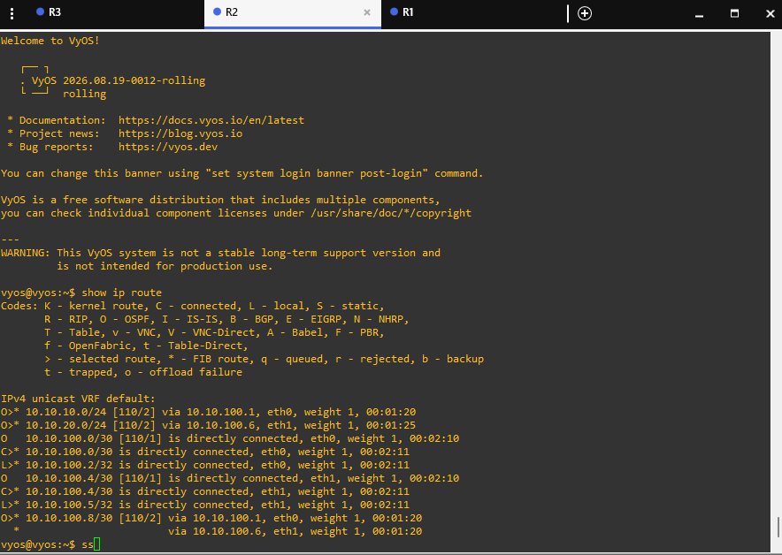
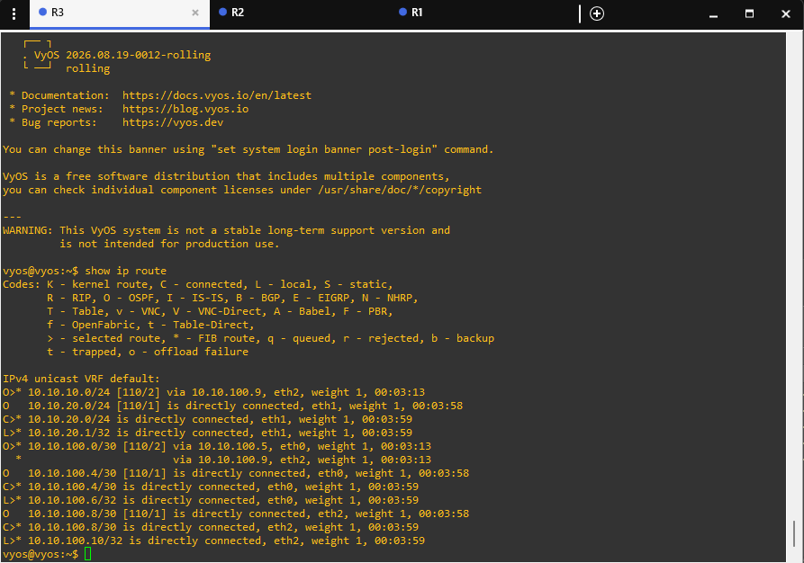

## Static Routing Topology

These static routes will be replaced by my OSPF implementation. However, I thought it would be neat to show how the topology looks currently



## OSPF Routing

The topology currently uses OSPFv2 for dynamic IPv4 routing.

All routers participate in backbone Area 0.

| Router | Router ID | OSPF Interfaces |
|---|---|---|
| R1 | `1.1.1.1` | eth0, eth1 |
| R2 | `2.2.2.2` | eth0, eth1 |
| R3 | `3.3.3.3` | eth0, eth1 |

### Routing Tables

R1 routing table:


R2 routing table:


R3 routing table:


### OSPF Adjacencies

```text
                          Area 0

       1.1.1.1            2.2.2.2          3.3.3.3
          R1 -------------- R2 -------------- R3
                Full                Full
```
## OSPF Redundancy Topology

A third transit network was added between R1 and R3 to provide an alternate Layer 3 path.

So our current network topology becomes 



And our updated routing tables:

R1 routing table:


R2 routing table:


R3 routing table:


Transit networks:
- R1-R2: `10.10.100.0/30`
- R2-R3: `10.10.100.4/30`
- R1-R3: `10.10.100.8/30`

## OSPF Adjacencies

With all links operational, the router topology forms a triangle:

```text
                          Area 0

                         2.2.2.2
                            R2
                           /  \
                          /    \
                         /      \
                1.1.1.1 -------- 3.3.3.3
                   R1                R3
```

R1 has two OSPF neighbors:

- R2 (`2.2.2.2`)
- R3 (`3.3.3.3`)

R2 has two OSPF neighbors:

- R1 (`1.1.1.1`)
- R3 (`3.3.3.3`)

R3 has two OSPF neighbors:

- R1 (`1.1.1.1`)
- R2 (`2.2.2.2`)

R1 reaches the PC2 LAN through the direct R1-R3 link.

R1's route to `10.10.20.0/24` is:

```text
O>* 10.10.20.0/24 [110/2] via 10.10.100.10, eth2
```

Traffic path:

```text
PC1 -> R1 -> R3 -> PC2
```

The OSPF cost is 2.

### Simulated R1-R3 Failure

R1's `eth2` interface was administratively disabled to simulate a link failure.

```text
set interfaces ethernet eth2 disable
```

The R1-R3 OSPF adjacency disappeared, leaving R1 with R2 as its remaining OSPF neighbor.

OSPF automatically recalculated the route to the PC2 LAN:

```text
O>* 10.10.20.0/24 [110/3] via 10.10.100.2, eth1
```

Traffic failed over to:

```text
PC1 -> R1 -> R2 -> R3 -> PC2
```

The OSPF cost increased from 2 to 3.

No manual route was added during the failure.

### Failover Verification

While the R1-R3 link was disabled, PC1 could still successfully ping PC2.

Traceroute changed from:

```text
PC1 -> R1 -> R3 -> PC2
```

to:

```text
PC1 -> R1 -> R2 -> R3 -> PC2
```

This confirmed that OSPF detected the topology change, recalculated the shortest path, and maintained end-to-end connectivity through the alternate route.

### Link Restoration

The preferred R1-R3 link was restored using:

```text
delete interfaces ethernet eth2 disable
```

After the link returned:

- R1 re-formed its OSPF adjacency with R3.
- R1's route to `10.10.20.0/24` returned to cost 2.
- The next hop changed back to `10.10.100.10`.
- Traceroute returned to the shorter `PC1 -> R1 -> R3 -> PC2` path.

This milestone demonstrates OSPF shortest-path selection, convergence, route recalculation, redundancy, and automatic failover.
