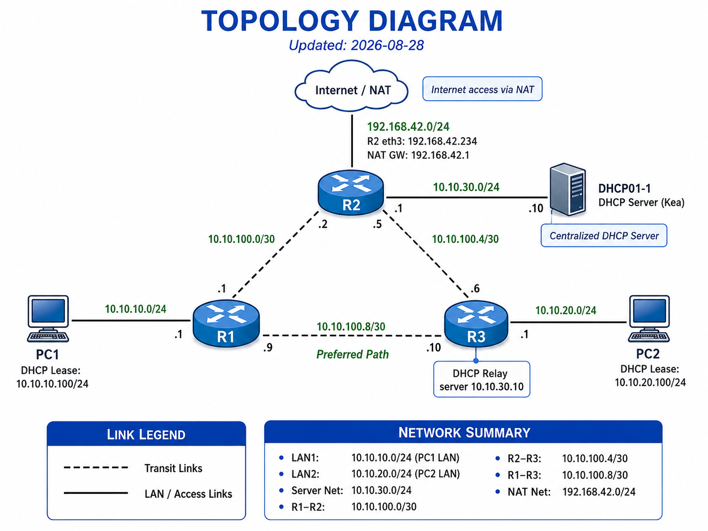
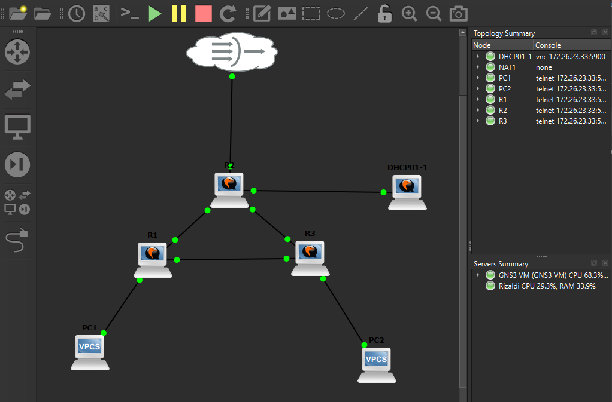

# Network Topology

This directory documents the evolution of the GNS3 networking homelab, from the original static-routing design to OSPF redundancy, centralized DHCP, and Internet connectivity through GNS3 NAT.

---

## Previous Topology: Static Routing 

These static routes were later replaced by OSPF. This diagram is kept to show the original topology before dynamic routing was implemented.


---

## OSPF Routing

The topology uses OSPFv2 for dynamic IPv4 routing.

All routers participate in backbone Area 0.

| Router | Router ID | OSPF Interfaces |
|---|---|---|
| R1 | `1.1.1.1` | `eth0`, `eth1`, `eth2` |
| R2 | `2.2.2.2` | `eth0`, `eth1`, `eth2` |
| R3 | `3.3.3.3` | `eth0`, `eth1`, `eth2` |

R2 `eth2` is configured as an **OSPF passive interface**. The `10.10.30.0/24` server network still needs to be advertised into OSPF, but DHCP01 is not an OSPF router. Making the interface passive prevents R2 from sending OSPF Hello packets or attempting to form an adjacency with the server.

### Original OSPF Routing Tables

R1 routing table:


R2 routing table:


R3 routing table:


### Original OSPF Adjacencies

```text
                          Area 0

       1.1.1.1            2.2.2.2          3.3.3.3
          R1 -------------- R2 -------------- R3
                Full                Full
```

---

## Previous Topology: OSPF Redundancy

A third transit network was added between R1 and R3 to provide an alternate Layer 3 path.


Updated routing tables:

R1 routing table:


R2 routing table:


R3 routing table:


Transit networks:

- R1-R2: `10.10.100.0/30`
- R2-R3: `10.10.100.4/30`
- R1-R3: `10.10.100.8/30`

### OSPF Adjacencies

With all router-to-router links operational, the topology forms a triangle:

```text
                          Area 0

                         2.2.2.2
                            R2
                           /  \
                          /    \
                         /      \
                1.1.1.1 -------- 3.3.3.3
                   R1                R3
```

R1 has two OSPF neighbors:

- R2 (`2.2.2.2`)
- R3 (`3.3.3.3`)

R2 has two OSPF neighbors:

- R1 (`1.1.1.1`)
- R3 (`3.3.3.3`)

R3 has two OSPF neighbors:

- R1 (`1.1.1.1`)
- R2 (`2.2.2.2`)

R1 normally reaches the PC2 LAN through the direct R1-R3 link.

R1's route to `10.10.20.0/24` is:

```text
O>* 10.10.20.0/24 [110/2] via 10.10.100.10, eth2
```

Normal traffic path:

```text
PC1 -> R1 -> R3 -> PC2
```

The OSPF cost is 2.

### Simulated R1-R3 Failure

R1's `eth2` interface was administratively disabled to simulate a link failure.

```text
set interfaces ethernet eth2 disable
```

The R1-R3 OSPF adjacency disappeared, leaving R1 with R2 as its remaining OSPF neighbor.

OSPF automatically recalculated the route to the PC2 LAN:

```text
O>* 10.10.20.0/24 [110/3] via 10.10.100.2, eth1
```

Traffic failed over to:

```text
PC1 -> R1 -> R2 -> R3 -> PC2
```

The OSPF cost increased from 2 to 3.

No manual route was added during the failure.

### Failover Verification

While the R1-R3 link was disabled:

- PC1 could still ping PC2.
- PC2 could still ping PC1.
- Both clients could still obtain DHCP leases from the centralized DHCP server.
- Both clients retained Internet connectivity through R2.

This confirmed that OSPF detected the topology change, recalculated the shortest path, and maintained end-to-end connectivity through the alternate route.

### Link Restoration

The preferred R1-R3 link was restored using:

```text
delete interfaces ethernet eth2 disable
```

After the link returned:

- R1 re-formed its OSPF adjacency with R3.
- R1's route to `10.10.20.0/24` returned to cost 2.
- The next hop changed back to `10.10.100.10`.
- Traffic returned to the shorter `PC1 -> R1 -> R3 -> PC2` path.

---

## Current Topology: Centralized DHCP and Internet Access

The current version of the lab adds a dedicated Ubuntu Server VM running Kea DHCPv4, a server subnet, DHCP relay on R1 and R3, and Internet access through a GNS3 NAT node connected to R2.

### Logical Topology



### GNS3 Topology




### Current Network Summary

| Network | Purpose |
|---|---|
| `10.10.10.0/24` | LAN1 / PC1 |
| `10.10.20.0/24` | LAN2 / PC2 |
| `10.10.30.0/24` | Server network / DHCP01 |
| `10.10.100.0/30` | R1-R2 transit |
| `10.10.100.4/30` | R2-R3 transit |
| `10.10.100.8/30` | Direct R1-R3 transit |
| `192.168.42.0/24` | GNS3 NAT-facing network |

### Key Device Addresses

| Device | Interface | Address / Assignment | Role |
|---|---|---|---|
| R1 | `eth0` | `10.10.10.1/24` | LAN1 gateway and DHCP relay |
| R1 | `eth1` | `10.10.100.1/30` | R1-R2 transit |
| R1 | `eth2` | `10.10.100.9/30` | Direct R1-R3 transit |
| R2 | `eth0` | `10.10.100.2/30` | R1-R2 transit |
| R2 | `eth1` | `10.10.100.5/30` | R2-R3 transit |
| R2 | `eth2` | `10.10.30.1/24` | Server-network gateway; OSPF passive |
| R2 | `eth3` | DHCP from GNS3 NAT | Internet-facing interface |
| R3 | `eth0` | `10.10.100.6/30` | R2-R3 transit |
| R3 | `eth1` | `10.10.20.1/24` | LAN2 gateway and DHCP relay |
| R3 | `eth2` | `10.10.100.10/30` | Direct R1-R3 transit |
| DHCP01 | `ens3` | `10.10.30.10/24` | Centralized Kea DHCP server |
| PC1 | `eth0` | DHCP: `10.10.10.100/24` current lease | LAN1 client |
| PC2 | `eth0` | DHCP: `10.10.20.100/24` current lease | LAN2 client |

R2 `eth3` received `192.168.42.234/24` during testing. This address is dynamically assigned by the **GNS3 NAT node's DHCP service**, not by DHCP01.

---

## Centralized DHCP

DHCP service was moved off R1 and onto the dedicated Ubuntu server `DHCP01`.

```text
DHCP01
IP: 10.10.30.10/24
Service: Kea DHCPv4
```

DHCP scopes:

| LAN | Pool | Default Gateway |
|---|---|---|
| LAN1 | `10.10.10.100` to `10.10.10.199` | `10.10.10.1` |
| LAN2 | `10.10.20.100` to `10.10.20.199` | `10.10.20.1` |

DNS is **not configured yet** for the client DHCP scopes.

### DHCP Relay

R1 relays DHCP requests from LAN1 to DHCP01:

```text
PC1 -> R1 -> DHCP01 (10.10.30.10)
```

R3 relays DHCP requests from LAN2 to DHCP01:

```text
PC2 -> R3 -> DHCP01 (10.10.30.10)
```

Both PCs successfully completed DHCP DORA and received:

```text
PC1: 10.10.10.100/24
Gateway: 10.10.10.1
DHCP Server: 10.10.30.10
```

```text
PC2: 10.10.20.100/24
Gateway: 10.10.20.1
DHCP Server: 10.10.30.10
```

---

## Internet Connectivity

R2 is the lab's Internet edge router.

The GNS3 NAT node provides an upstream DHCP address and default gateway to R2 `eth3`.

Observed during testing:

```text
R2 eth3:     192.168.42.234/24
NAT gateway: 192.168.42.1
```

R2 performs source NAT masquerading for the internal `10.10.0.0/16` address space.

Conceptually:

```text
Internal client
     |
  R1 or R3
     |
     R2
     |
Source NAT / Masquerade
     |
  GNS3 NAT
     |
  Internet
```

R2 also originates its default route (`0.0.0.0/0`) into OSPF. This allows R1 and R3 to learn that Internet-bound traffic should be forwarded toward R2.

Both PC1 and PC2 successfully reached `8.8.8.8` after the OSPF default route was advertised.

---

## Current Routing Behavior

Under normal conditions:

```text
PC1 -> R1 -> R3 -> PC2
```

The direct R1-R3 link on `10.10.100.8/30` is preferred.

If that link fails:

```text
PC1 -> R1 -> R2 -> R3 -> PC2
```

During the tested failure condition:

- OSPF reconverged automatically.
- The route cost increased from 2 to 3.
- Client-to-client communication continued.
- Centralized DHCP continued working.
- Internet access continued working.