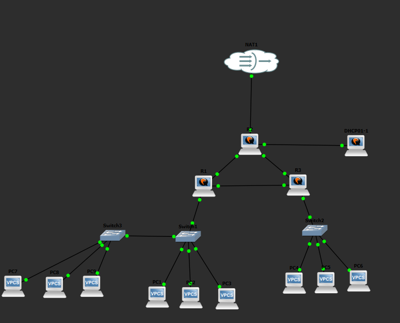

# Network Topology

This directory documents the evolution of the GNS3 networking homelab, from the original static-routing design to OSPF redundancy, centralized DHCP/DNS, VLAN segmentation, and Internet connectivity through GNS3 NAT.

---

## Previous Topology: Static Routing

These static routes were later replaced by OSPF. This diagram is kept to show the original topology before dynamic routing was implemented.


---

## OSPF Routing

The topology uses OSPFv2 for dynamic IPv4 routing. All three VyOS routers participate in backbone Area 0.

| Router | Router ID | Active OSPF Interfaces |
|---|---|---|
| R1 | `1.1.1.1` | `eth1`, `eth2`, `eth0.10`, `eth0.40`, `eth0.50` |
| R2 | `2.2.2.2` | `eth0`, `eth1`, `eth2` |
| R3 | `3.3.3.3` | `eth0`, `eth2`, `eth1.20`, `eth1.60`, `eth1.70` |

The VLAN subinterfaces on R1 and R3 are configured as **OSPF passive interfaces**. They advertise the client VLAN networks without attempting to form OSPF adjacencies with end devices.

R2 `eth2` is also configured as an **OSPF passive interface**. The `10.10.30.0/24` server network is advertised into OSPF, but DHCP01 is not an OSPF router.

The parent interfaces `R1 eth0` and `R3 eth1` are used only as 802.1Q trunk parents and are no longer configured as OSPF interfaces.

### OSPF Core Adjacencies

With all router-to-router links operational, the topology forms a triangle:

```text
                          Area 0

                         2.2.2.2
                            R2
                           /  \
                          /    \
                         /      \
                1.1.1.1 -------- 3.3.3.3
                   R1                R3
```

Transit networks:

- R1-R2: `10.10.100.0/30`
- R2-R3: `10.10.100.4/30`
- R1-R3: `10.10.100.8/30`

The direct R1-R3 link is normally preferred for traffic between the R1-side and R3-side VLANs.

### Simulated R1-R3 Failure

R1's `eth2` interface was administratively disabled to simulate a link failure:

```text
set interfaces ethernet eth2 disable
```

OSPF automatically recalculated routes through R2.

Normal path:

```text
R1 -> R3
```

Failover path:

```text
R1 -> R2 -> R3
```

During the failure test:

- Cross-VLAN communication continued.
- DHCP relay continued working.
- Clients continued reaching DHCP01.
- Internet access through R2 continued working.
- No static routes were added manually.

The preferred link was restored with:

```text
delete interfaces ethernet eth2 disable
```

---

## Current Topology: VLANs, Centralized DHCP/DNS, OSPF, and NAT

The current lab uses VLAN-based Layer 2 segmentation, router-on-a-stick routing on R1 and R3, centralized DHCP and DNS on DHCP01, OSPF Area 0 between all routers, and Internet access through a GNS3 NAT node connected to R2.

### Logical Topology


### Current GNS3 Topology



### Network Summary

| Network | Purpose |
|---|---|
| `10.10.10.0/24` | VLAN 10 |
| `10.10.20.0/24` | VLAN 20 |
| `10.10.30.0/24` | Server network / DHCP01 |
| `10.10.40.0/24` | VLAN 40 |
| `10.10.50.0/24` | VLAN 50 |
| `10.10.60.0/24` | VLAN 60 |
| `10.10.70.0/24` | VLAN 70 |
| `10.10.100.0/30` | R1-R2 transit |
| `10.10.100.4/30` | R2-R3 transit |
| `10.10.100.8/30` | Direct R1-R3 transit |
| `192.168.42.0/24` | GNS3 NAT-facing network |

The internal lab address space is `10.10.0.0/16`.

---

## VLAN and Layer 2 Design

### R1 Side

R1 uses `eth0` as an 802.1Q trunk parent.

| VLAN | Subinterface | Gateway | Connected Switches / Clients |
|---|---|---|---|
| 10 | `eth0.10` | `10.10.10.1/24` | Switch1 and Switch3 |
| 40 | `eth0.40` | `10.10.40.1/24` | Switch1 and Switch3 |
| 50 | `eth0.50` | `10.10.50.1/24` | Switch1 and Switch3 |

Switch1 connects directly to R1. Switch1 and Switch3 are joined by an 802.1Q trunk carrying VLANs `10`, `40`, and `50`.

R1 is **not** directly connected to Switch3.

### R3 Side

R3 uses `eth1` as an 802.1Q trunk parent.

| VLAN | Subinterface | Gateway | Connected Switch |
|---|---|---|---|
| 20 | `eth1.20` | `10.10.20.1/24` | Switch2 |
| 60 | `eth1.60` | `10.10.60.1/24` | Switch2 |
| 70 | `eth1.70` | `10.10.70.1/24` | Switch2 |

### Layer 2 Trunks

| Link | Type | VLANs Carried |
|---|---|---|
| R1 `eth0` ↔ Switch1 | 802.1Q trunk | 10, 40, 50 |
| Switch1 ↔ Switch3 | 802.1Q trunk | 10, 40, 50 |
| R3 `eth1` ↔ Switch2 | 802.1Q trunk | 20, 60, 70 |

---

## Key Device Addresses

| Device | Interface | Address / Assignment | Role |
|---|---|---|---|
| R1 | `eth0.10` | `10.10.10.1/24` | VLAN 10 gateway / DHCP relay |
| R1 | `eth0.40` | `10.10.40.1/24` | VLAN 40 gateway / DHCP relay |
| R1 | `eth0.50` | `10.10.50.1/24` | VLAN 50 gateway / DHCP relay |
| R1 | `eth1` | `10.10.100.1/30` | R1-R2 transit |
| R1 | `eth2` | `10.10.100.9/30` | Direct R1-R3 transit |
| R2 | `eth0` | `10.10.100.2/30` | R1-R2 transit |
| R2 | `eth1` | `10.10.100.5/30` | R2-R3 transit |
| R2 | `eth2` | `10.10.30.1/24` | Server-network gateway; OSPF passive |
| R2 | `eth3` | DHCP from GNS3 NAT | Internet-facing interface |
| R3 | `eth0` | `10.10.100.6/30` | R2-R3 transit |
| R3 | `eth1.20` | `10.10.20.1/24` | VLAN 20 gateway / DHCP relay |
| R3 | `eth1.60` | `10.10.60.1/24` | VLAN 60 gateway / DHCP relay |
| R3 | `eth1.70` | `10.10.70.1/24` | VLAN 70 gateway / DHCP relay |
| R3 | `eth2` | `10.10.100.10/30` | Direct R1-R3 transit |
| DHCP01 | `ens3` | `10.10.30.10/24` | Kea DHCP + BIND9 DNS |
| PC1 | `eth0` | DHCP: `10.10.10.100/24` | VLAN 10 |
| PC2 | `eth0` | DHCP: `10.10.40.100/24` | VLAN 40 |
| PC3 | `eth0` | DHCP: `10.10.50.100/24` | VLAN 50 |
| PC4 | `eth0` | DHCP: `10.10.20.100/24` | VLAN 20 |
| PC5 | `eth0` | DHCP: `10.10.60.100/24` | VLAN 60 |
| PC6 | `eth0` | DHCP: `10.10.70.100/24` | VLAN 70 |
| PC7 | `eth0` | DHCP: `10.10.10.101/24` | VLAN 10 |
| PC8 | `eth0` | DHCP: `10.10.40.101/24` | VLAN 40 |
| PC9 | `eth0` | DHCP: `10.10.50.101/24` | VLAN 50 |

R2 `eth3` received `192.168.42.234/24` during testing. This address is dynamically assigned by the GNS3 NAT node and is not guaranteed to remain the same.

---

## Centralized DHCP

DHCP is provided by the dedicated Ubuntu server `DHCP01`.

```text
DHCP01
IP: 10.10.30.10/24
Service: Kea DHCPv4
```

### DHCP Scopes

| VLAN | Subnet | Pool | Default Gateway | DNS Server |
|---|---|---|---|---|
| 10 | `10.10.10.0/24` | `10.10.10.100` to `10.10.10.199` | `10.10.10.1` | `10.10.30.10` |
| 20 | `10.10.20.0/24` | `10.10.20.100` to `10.10.20.199` | `10.10.20.1` | `10.10.30.10` |
| 40 | `10.10.40.0/24` | `10.10.40.100` to `10.10.40.199` | `10.10.40.1` | `10.10.30.10` |
| 50 | `10.10.50.0/24` | `10.10.50.100` to `10.10.50.199` | `10.10.50.1` | `10.10.30.10` |
| 60 | `10.10.60.0/24` | `10.10.60.100` to `10.10.60.199` | `10.10.60.1` | `10.10.30.10` |
| 70 | `10.10.70.0/24` | `10.10.70.100` to `10.10.70.199` | `10.10.70.1` | `10.10.30.10` |

### DHCP Relay

R1 relays DHCP requests from VLANs 10, 40, and 50 to DHCP01. R3 relays DHCP requests from VLANs 20, 60, and 70 to DHCP01.

```text
Client broadcast
      |
      v
R1 or R3 VLAN subinterface
      |
      | DHCP relay
      v
DHCP01 (10.10.30.10)
```

All nine clients successfully obtained leases from DHCP01.

---

## Centralized DNS

DHCP01 also runs BIND9 and acts as the DNS server for the lab.

```text
DNS Server: 10.10.30.10
Internal Zone: gns3.lab
```

The DHCP scopes distribute `10.10.30.10` as the DNS server to all client VLANs.

BIND9 provides:

- Recursive DNS service for internal clients.
- Forwarding of external queries to `8.8.8.8` and `1.1.1.1`.
- Authoritative resolution for the internal `gns3.lab` zone.

Current internal records include:

| Name | Address |
|---|---|
| `dhcp01.gns3.lab` | `10.10.30.10` |
| `r1.gns3.lab` | `10.10.100.1` |
| `r2.gns3.lab` | `10.10.100.2` |
| `r3.gns3.lab` | `10.10.100.6` |

Client PCs are not currently assigned static DNS records because their DHCP addresses are dynamic.

DNS testing confirmed that clients can resolve both external names such as `google.com` and internal names such as `r1.gns3.lab` and `dhcp01.gns3.lab`.

---

## Internet Connectivity and NAT

R2 is the lab's Internet edge router.

The GNS3 NAT node provides an upstream DHCP address and default gateway to R2 `eth3`.

Observed during testing:

```text
R2 eth3:     192.168.42.234/24
NAT gateway: 192.168.42.1
```

R2 performs source NAT masquerading for the complete internal address space:

```text
10.10.0.0/16
```

R2 also originates the default route `0.0.0.0/0` into OSPF so R1 and R3 learn that Internet-bound traffic should be forwarded toward R2.

Internet connectivity has been verified from multiple client VLANs.

---

## Current Routing Behavior

Under normal conditions, traffic between the R1 side and R3 side prefers the direct R1-R3 link.

Example:

```text
PC2 (VLAN 40)
    |
    R1
    |
direct R1-R3 link
    |
    R3
    |
PC5 (VLAN 60)
```

If the direct R1-R3 link fails:

```text
PC2
 |
 R1
 |
 R2
 |
 R3
 |
PC5
```

During the tested failure condition:

- OSPF reconverged automatically.
- Cross-VLAN communication continued.
- Centralized DHCP continued working.
- DNS remained reachable.
- Internet connectivity continued through R2.

---

## Current Project State

The lab currently demonstrates:

- Multi-router OSPF Area 0 routing
- Redundant Layer 3 paths and automatic failover
- VLAN segmentation
- 802.1Q trunking
- Router-on-a-stick inter-VLAN routing
- Centralized Kea DHCP
- DHCP relay across routed networks
- Centralized BIND9 DNS
- Internal DNS zone hosting
- External DNS forwarding
- Source NAT / masquerading
- OSPF default-route propagation
- End-to-end Internet connectivity

At this stage, VLANs provide separate Layer 2 broadcast domains, but routing between VLANs is still permitted.

The next planned milestone is to implement **inter-VLAN security controls using VyOS firewall policies / ACL-style rules**.
